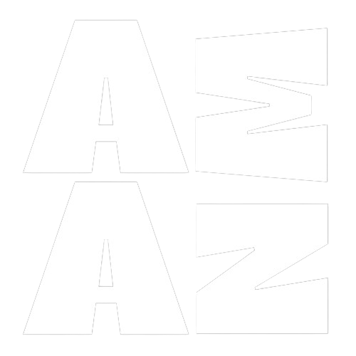
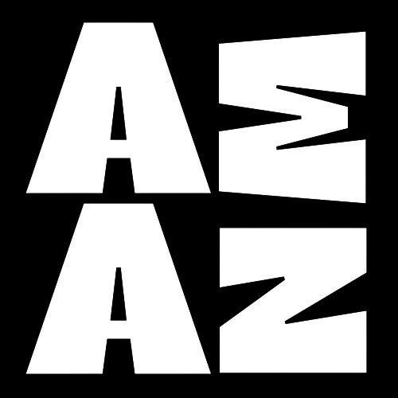

<!DOCTYPE html>
<html lang="en">
<head>
    <link rel="preconnect" href="https://fonts.googleapis.com">
<link rel="preconnect" href="https://fonts.gstatic.com" crossorigin>
<link href="https://fonts.googleapis.com/css2?family=Poppins:ital,wght@0,100;0,200;0,300;0,400;0,500;0,600;0,700;0,800;0,900;1,100;1,200;1,300;1,400;1,500;1,600;1,700;1,800;1,900&display=swap" rel="stylesheet">

</head>
<body style="background-color:black;">

 

<b>I am a Information Technology Student at HNGU University, 

Technology excites me and I am always in awe of the change it drives in the world. Certain skills that I have worked with include Data Structures and Algorithms (Java), Full-Stack  Development, Machine Learning (Python). with a keen eye for detail and a knack for problem-solving,  

I am dedicated to honing my skills and expanding my knowledge in these fields. Committed to delivering high-quality work, I thrive in dynamic environments where creativity and innovation are encouraged. Let's connect and collaborate on projects that push the boundaries of technology and design..</b>
 

<ul>
    <li>:nerd_face: Currently Improving <b>Frontend Skills</b> & learning <b>MERN Stack </b></li>
    <li>🚀 Making Projects in my free time</li> 
    <li>:muscle: Raising my bars with **UX Skils** & **Dev Affection**</li> 
    <li>:heart: Coffee</li>
</ul>
 
  

 <h3 align="center"></h3>

  

  

  

<h3 align="left">🌐 Socials:</h3>

&nbsp;

&nbsp;

&nbsp;

&nbsp;

&nbsp;

&nbsp;

&nbsp;

<h3 align="left" >Tech Stack 🥞</h3>

  

 
<h3 align="left" style="font-weight: 300;">Stats 📊:</h3>

<h3 align="left">💖 Support the Project:</h3>

  

 

</body>

</html>